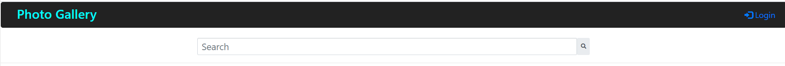

# Developer Intern Challenge - Image Gallery

### Built-on

1. Django - Python (need installation of Python and Django)
2. Bootstrap, JavaScript, JQuery

### Login Require/Not Require

1. All public images can be viewed without Login
2. Search images by title is accessible without Login
3. At right top click Login button
   
4. Pre-Registered usernames and passwords

   | S.No | Username | Password  |
   | ---- | -------- | --------- |
   | 1.   | admin    | admin     |
   | 2.   | user-01  | photo1234 |
   | 3.   | user-02  | photo1234 |
   | 4.   | user-03  | photo1234 |
