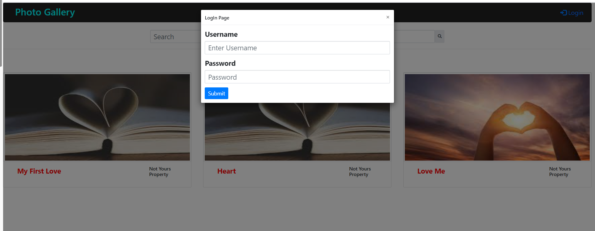

# Developer Intern Challenge - Image Gallery

### Built-on

1. Django - Python (need installation of Python and Django)
2. Bootstrap, JavaScript, JQuery

### Login Require/Not Require

1. All public images can be viewed without Login
2. Search images by title is accessible without Login
3. At right top click Login button
   
4. Pre-Registered usernames and passwords

   | S.No | Username | Password  |
   | ---- | -------- | --------- |
   | 1.   | admin    | admin     |
   | 2.   | user-01  | photo1234 |
   | 3.   | user-02  | photo1234 |
   | 4.   | user-03  | photo1234 |

5. After Login nine (9) buttons / options are available for any user
   

   | S.No | Button / Option        | Functionality                                       |
   | ---- | ---------------------- | --------------------------------------------------- |
   | 1.   | Home Page              | Navigate to Main/Home page                          |
   | 2.   | Add Single Photo       | Add images individually                             |
   | 3.   | Add Multiple Photos    | Add multiple images all together                    |
   | 4.   | Delete Multiple Photos | Select multiple images and delete on a click        |
   | 5.   | Filter Photo           | dropdown contain four (4) options                   |
   | 6.   | User All Photos        | Current user's images will filter                   |
   | 7.   | User Private Photos    | Current user's private images will filter           |
   | 8.   | User Public Photos     | Current user's public images will filter            |
   | 9.   | All Public Photos      | Current user's and Others public images will filter |

   
